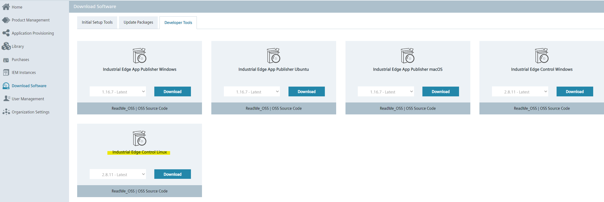
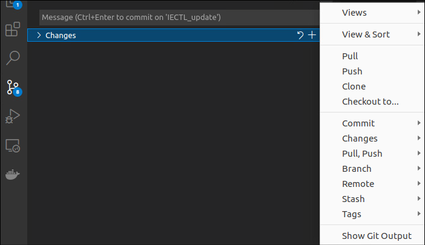

# Upload App to IEM with IECTL

- [Upload App to IEM with IECTL](#upload-app-to-iem-with-iectl)
  - [Prerequisites](#prerequisites)
    - [Expose Docker daemon](#expose-docker-daemon)
    - [Install IECTL](#install-iectl)
  - [Build application](#build-application)
    - [Download Repository](#download-repository)
    - [Build docker image](#build-docker-image)
  - [Customize shell script and upload app to IEM](#customize-shell-script-and-upload-app-to-iem)
  
## Prerequisites

*Note: Linux VM with docker and docker-compose installed is used in this example*

### Expose Docker daemon

In order to run shell script for this example, you need to expose docker daemon TCP port 2375. To do that, follow these instructions:

1. Open terminal on your Linux VM. 
2. Use the command sudo systemctl edit docker.service to open an override file for docker.service in a text editor.

```bash
sudo systemctl edit docker.service
```

1. Check, add or modify the following lines, substituting your own values with the following ones:

```bash
[Service]
ExecStart=
ExecStart=/usr/bin/dockerd -H fd:// -H tcp://127.0.0.1:2375
```

In this example the API will listen at `127.0.0.1:2375`. You can change the IP according to your setup, e.g. if you want to reach the docker engine from a external host, enter the external IP of the host.
4. Save the file.
5. Reload the systemctl configuration:

```bash
sudo systemctl daemon-reload
```

6. Restart Docker:

```bash
sudo systemctl restart docker.service
```

7. Check if the new configuration was applied:

```bash
sudo docker info
```

The output should state that the API is accessible on your IP and Port.

__Warning__ : Access to the remote API is equivalent to root access on the host. Do this in trusted environment ONLY.

### Install IECTL 

To install the IECTL on your Linux VM, follow these instructions:

1. Go to your your [Industrial Edge Hub](https://iehub.eu1.edge.siemens.cloud/downloads), under "Download Software" and "Developer Tools", you can find your IECTL (Industrial Edge Control Linux) executable file. Download the .zip file to your device and extract it:




2. Open terminal in the directory with the IECTL file and run this command to make the IECTL executable.  

    ```bash
    chmod +x iectl
    sudo mv iectl /usr/local/bin
    iectl version
    ```

3. If you see the IECTL version number, you have successfully installed IECTL on your device. 

## Build application

### Download Repository

* Trough terminal:
```bash
git clone https://github.com/industrial-edge/upload-app-to-iem-ie-app-publisher-cli.git
```

* Trough VSCode:  
   - <kbd>CTRL</kbd>+<kbd>&uarr; SHIFT</kbd>+<kbd>P</kbd> or <kbd>F1</kbd> to open VSCode's command pallette and type `git clone`
  - Under "Source Control", then the three dots in the upper-right corner of the source control tree and "Clone":
  


### Build docker image

- Navigate into `src/app` and find the file named `Dockerfile.example`. The `Dockerfile.example` is an example Dockerfile that can be used to build the docker image(s) of the service(s) that runs in this application example. If you choose to use these, rename them to `Dockerfile` before proceeding
- Open a console in the root folder `src/` (where the `docker-compose` file is)
- Use the `docker compose build` (replaces the older `docker-compose build`) command to build the docker image of the service which is specified in the docker-compose.yml file.
- These Docker images can now be used to build your app with the IECTL
- `docker images` can be used to check for the images

## Customize shell script and upload app to IEM

*Note: VS Code is used as a development environment*

1. Open the shell [script](../src/script.sh) within the [src](../src) folder in your development environment. The file structure should be like this: 

    ```txt
    ├── app
    │   ├── docker-compose.prod.yml
    │   ├── docker-compose.yml
    │   └── web
    │       ├── Dockerfile.example
    │       └── html
    │           └── index.html
    ├── appicon
    │   └── icon.png
    ├── script
    │   ├── getAppId.py
    │   ├── getAppVersion.py
    │   └── getDeviceId.py
    ├── script.sh

    ```

2. In order to successfully upload this application to your IEM, you need to modify the provided shell script. You can do this by setting several environment variables in the beginning of [script](../src/script.sh) by modifying variables in angle brackets:  

    ```bash
    # IEM configuration variables export IEM_USER="ivan.castro-bernaza@siemens.com"
    export IEM_USER="<iem_user>"
    export IEM_URL="<iem_URL>"
    export IEM_PASSWORD="<iem_password>"

    # Application configuration variables
    export APP_NAME="<App_name>" # Application name
    export APP_REPO="<App_repo>" # Applications repository (unique)

    # IECTL environmental variables
    export IE_SKIP_CERTIFICATE=true
    export EDGE_SKIP_TLS=1
    
    # Project envirinmental variables 
    export PROJECT_PATH_PREFIX="<Absolute Path to src files>" # Prefix of the absolute path where the project is inside of your development environment

    ```

**Important Notes:**\
*- URL needs to be the exact URL, for example: "https://10.31.1.30:443" 
*- Use the production [docker-compose.prod.yml](../src/app/docker-compose.prod.yml) file with **Absolute Path** for the COMPOSE_PATH variable* \
*- Setting IE_SKIP_CERTIFICATE environmental variable will skip the certificates check by your server and therefore use this in trusted environment only!* \
*- Create a folder named "workspace" on src/ before execute the script.sh*. If you created already one and want to do it from the beginning, delete the whole workspace folder and everything in it and create a new empty one.

3. When you are finished with modifying shell script, you can start the shell script to trigger the upload process by running this command:

    ```bash
    cd src/
    ./script.sh
    ```

4. If your configuration is correct, you should get the notification that you application was uploaded successfully.

